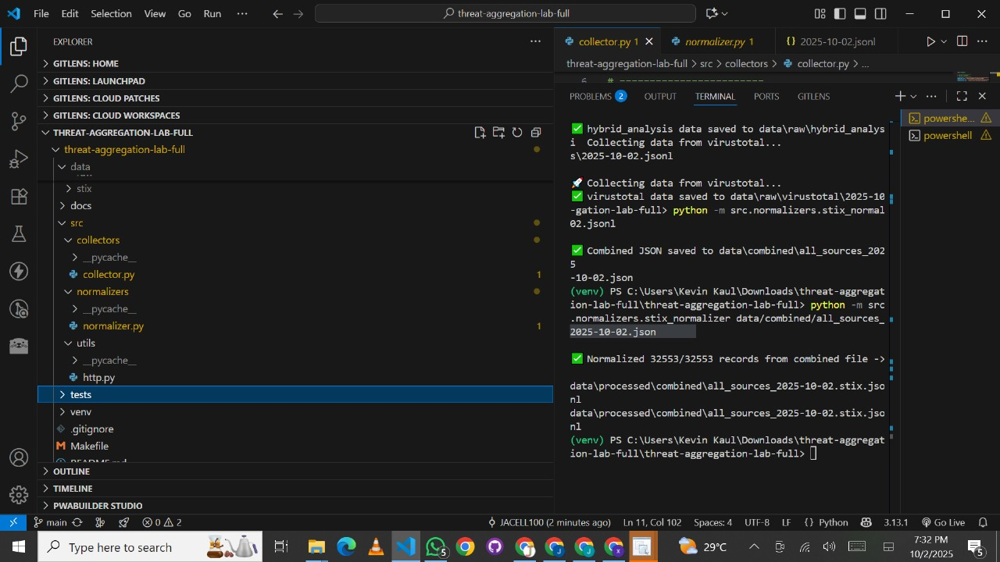

# Threat Intelligence Aggregation Platform

A comprehensive platform for collecting, normalizing, and visualizing threat intelligence from multiple sources.

## 🎯 Features

### Multi-Source Collection
Gathers threat data from 8 different sources:
- **AlienVault OTX** - Open Threat Exchange
- **Abuse.ch URLhaus** - Malicious URL database
- **AbuseIPDB** - IP address abuse reports
- **GreyNoise** - Internet scanner intelligence
- **Hybrid Analysis** - Malware analysis sandbox
- **Shodan** - Internet-connected device search engine
- **Spamhaus DROP** - Don't Route Or Peer lists
- **VirusTotal** - File and URL analysis

### Data Normalization
- Converts raw threat data into standardized **STIX format**
- Ensures consistency across different threat intelligence sources
- Facilitates integration with security tools and workflows

### Interactive Dashboard
- Web-based visualization of threat intelligence data
- Drag-and-drop interface for data files
- Real-time data exploration and analysis

### Export Capabilities
- Export merged data in **JSONL format**
- Compatible with common threat intelligence platforms

## 📋 Requirements

- Python 3.x
- pip (Python package installer)
- Virtual environment (recommended)

## 🚀 Installation

### 1. Clone the repository
```bash
git clone <repository-url>
cd threat-aggregation-lab-full
```

### 2. Create and activate virtual environment
```bash
# Create virtual environment
python -m venv venv

# Activate on Linux/Mac
source venv/bin/activate

# Activate on Windows
venv\Scripts\activate
```

### 3. Install dependencies
```bash
pip install -r requirements.txt
```

## ⚙️ Configuration

Add your API keys to the configuration file for each service you want to use:

- `OTX_API_KEY` - AlienVault OTX API key
- `SHODAN_API_KEY` - Shodan API key
- `ABUSEIPDB_API_KEY` - AbuseIPDB API key
- `GREYNOISE_API_KEY` - GreyNoise API key
- `HYBRID_API_KEY` - Hybrid Analysis API key
- `VT_API_KEY` - VirusTotal API key

## 💻 Usage

### Collecting Data
Run individual collectors to gather threat intelligence:
```bash
python -m src.collectors.collector
```

### Normalizing Data
Convert raw data to STIX format:
```bash
python -m src.normalizers.normalizer <input-file>
```

### Viewing Results
1. Open `index.html` in a web browser
2. Drag and drop your `.jsonl` or `.stix.jsonl` files onto the interface
3. Explore the visualizations and data analysis

## 📁 Data Structure

```
data/
├── raw/           # Raw data from each source
├── processed/     # Normalized STIX format data
└── combined/      # Merged data from all sources
```

<div>
    
</div>
<div>
    
</div>
<div>
    
</div>
<div>
    
</div>
<div>
    
</div>
<div>
    
</div>
<div>
    
</div>